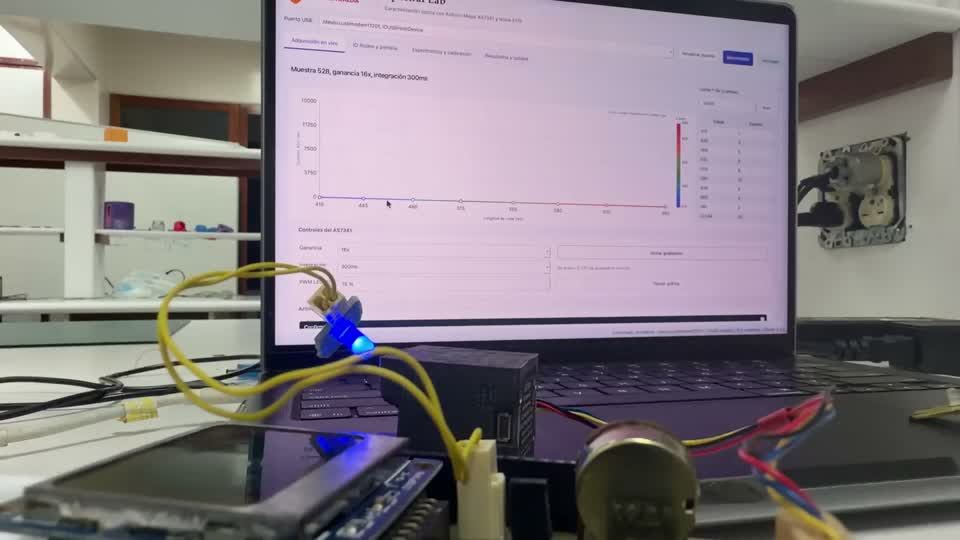

# LED 1, emisión azul visible

[Abrir el clip MP4](media/clips/01_led_azul.mp4)

Intervalo en el original: 00:00.000 a 00:39.000.

La placa emite luz azul visible frente al AS7341. La GUI recibe cuentas del firmware y representa la respuesta por bandas. El clip también muestra la manipulación previa al cambio de placa.

Para repetirlo, conserva la misma distancia y orientación entre LED y sensor. Registra ganancia, integración y PWM antes de guardar una captura.

