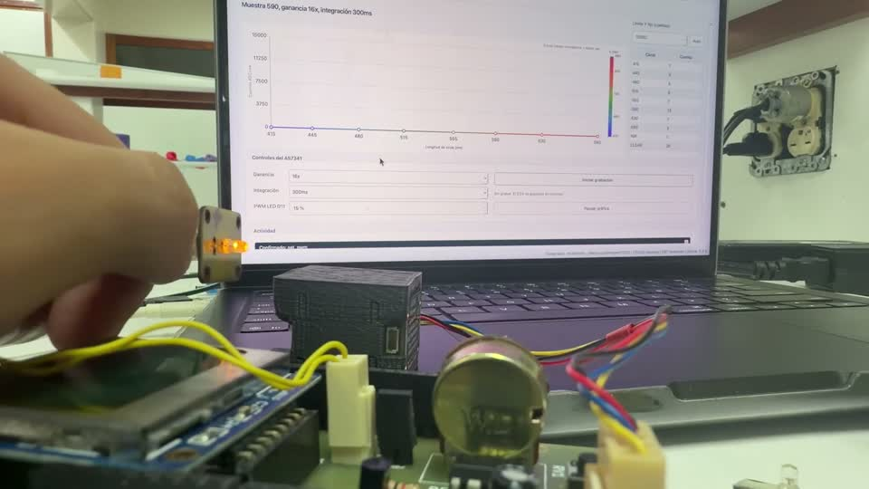

# LED 2, emisión ámbar visible

[Abrir el clip MP4](media/clips/02_led_ambar.mp4)

Intervalo en el original: 00:39.000 a 01:43.000.

La segunda placa muestra una emisión ámbar visible. Durante esta etapa se observa la respuesta de la GUI y la interacción con sus controles.

El color observado por la cámara es una referencia visual. La banda central del LED debe confirmarse con su ficha técnica o una medición espectral calibrada.

