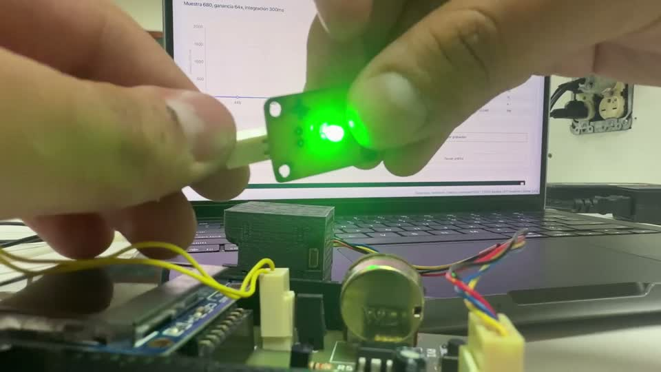

# LED 3

[Abrir el clip MP4](media/clips/03_led_3.mp4)

Intervalo en el original: 01:43.000 a 02:47.000.

La tercera placa se conecta y su emisión se observa como verde intensa en la cámara. La GUI muestra una distribución distinta de cuentas entre las bandas del AS7341.

No se asigna una longitud de onda nominal porque el video no aporta la identificación del componente. Documenta el código del LED y su corriente cuando se repita el ensayo.

