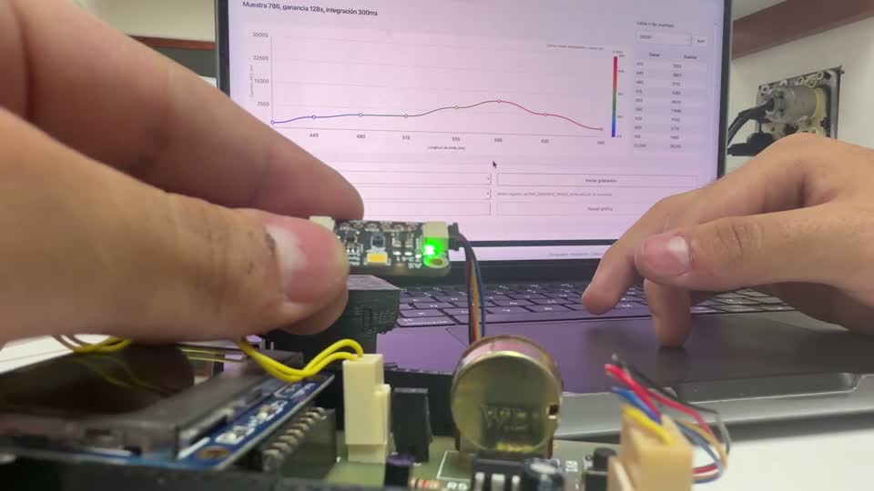

# LED 4

[Abrir el clip MP4](media/clips/04_led_4.mp4)

Intervalo en el original: 02:47.000 a 03:21.165.

La cuarta placa tiene un diseño físico distinto. En el clip se observa una emisión verde y una curva amplia en la GUI. La etapa incluye la conexión, la presentación de la placa y la respuesta recibida.

La comparación con el LED 3 debe hacerse con los valores raw y la configuración guardada, no solo con la apariencia de la cámara.

