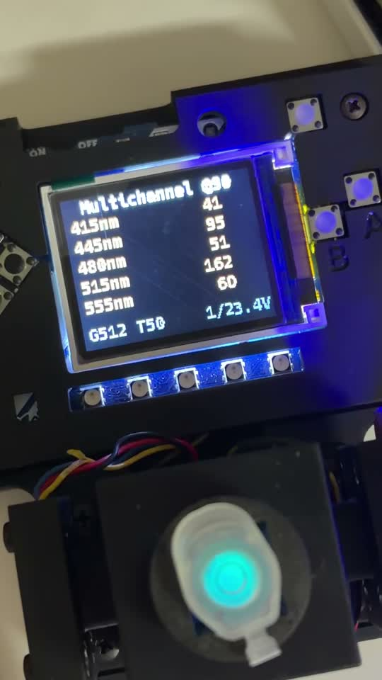

# Demostración del IO Rodeo

[Abrir el video MP4](media/demostracion_funcionamiento.mp4)

## Qué muestra

El video registra el equipo IO Rodeo encendido, la pantalla multicanal y el montaje óptico conectado. La pantalla presenta las bandas del AS7341 en páginas, mientras el conjunto mantiene el formato físico del fluorímetro.

## Firmware relacionado

Consulta [`../../Firmware/IO_Rodeo_PyBadge/v3.0_as7341/`](../../Firmware/IO_Rodeo_PyBadge/v3.0_as7341/) para el snapshot que añade `Multichannel 90` y el AS7341 a 90 grados.

## Comprobaciones de uso

1. Apaga el equipo antes de cambiar sensores o conexiones.
2. Confirma AS7341 en el canal 3 y TSL2591 en el canal 0 del PCA9546A.
3. Carga el snapshot completo en `CIRCUITPY`.
4. Inicia `Multichannel 90` y revisa ambas páginas.
5. Si aparece `OVFL`, reduce ganancia, tiempo de integración o intensidad óptica.

El video confirma operación visible del montaje. No demuestra calibración absoluta del AS7341 ni exactitud del cociente ratiométrico.

